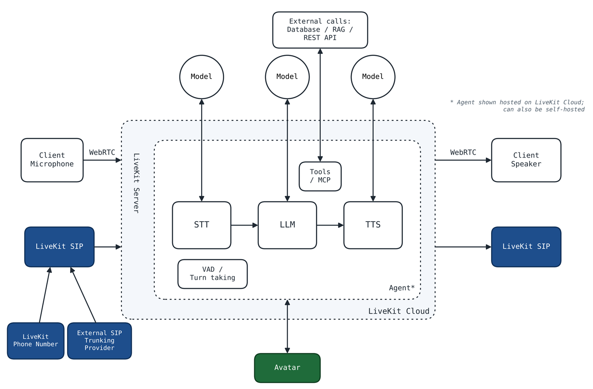

# voice-agent PoC

basic LiveKit voice agent. VAD + turn detector -> STT -> LLM (w/ 2 tools) -> TTS.
stt/llm/tts go through LiveKit Inference so you only need LiveKit Cloud keys, no deepgram/openai/cartesia accounts.


## setup


```
python -m venv .venv && source .venv/bin/activate
pip install -r requirements.txt
cp .env.example .env    # fill in your keys from cloud.livekit.io (free tier is fine)
python -m livekit.agents download-files
```

## run

- `python agent.py console` - talk to it in the terminal using your mic/speakers. easiest way to test
- `python agent.py dev` - registers with LiveKit Cloud. open https://agents-playground.livekit.io, connect to your project and talk to it from the browser

try: "what's the status of order 1001" or "what's the weather in pune"

## what's where

- `prewarm()` loads silero VAD once per process
- `turn_handling` - semantic turn detector, endpointing min/max delay, preemptive generation, interruptions
- `metrics_collected` handler logs per-turn latency (eou delay, llm ttft, tts ttfb). watch these

## swapping providers

change the model strings in `AgentSession`, e.g. `llm="google/gemini-2.5-flash"`. or use provider plugins directly (`pip install "livekit-agents[openai]"` and pass `openai.LLM(...)`) if you want your own api key
